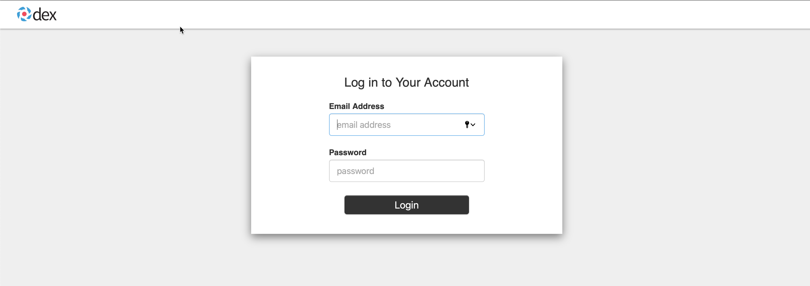
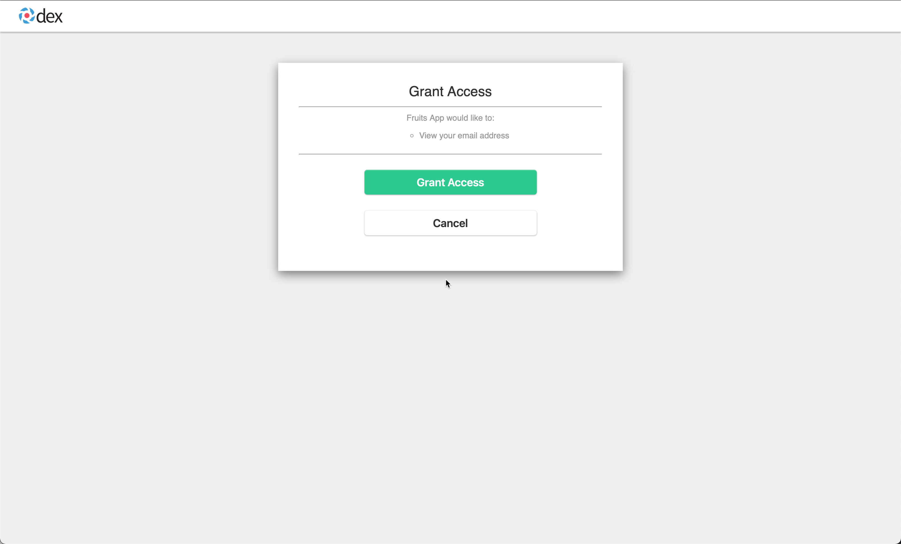
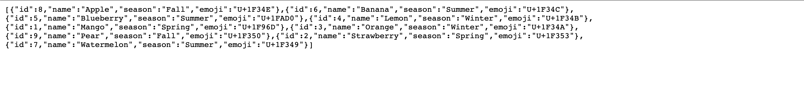

At the end of this chapter you would have known how to:

- [x] Deploy [dexidp](https://dexidp.io){target=_blank}
- [x] Configure authentication to Fruits API

## Pre-requisties

We will be integrating GitHub via dexidp. For us to integrate dex with [GithHub oAuth](https://github.com/settings/applications/new) you need to have oAuth app registered and have the follwing credentials handy,

- GitHub oAuth ClientId
- GitHub oAuth CientSecret
- GitHub Organisation to use

## Ensure Enviroment

We will use the following variables as part of this module,

```shell
export GH_OAUTH_CLIENT_ID=<your github oauth client id>
export GH_OAUTH_CLIENT_SECRET=<your github oauth client secret>
export GH_OAUTH_ORG=<the github org to use>
```

## Prepare Dex Deployment

### Create Namespace

```shell
kubectl apply -f  $TUTORIAL_HOME/cluster/dex/namespace.yaml
```

### Create Github Secret Env file

{== TODO Check ==}
Copy the template to env file,

```shell
cp $TUTORIAL_HOME/cluster/dex/github.env.secret.template $TUTORIAL_HOME/cluster/dex/github.env.secret
```

Update the `$TUTORIAL_HOME/cluster/dex/github.env.secret` values to map to your environment.

### Copy Trusted CA certificates

```shell
envsubst < $TUTORIAL_HOME/cluster/gloo/trusted-ca.yaml | kubectl apply -n dex -f -
```

### Dex SSL Certificates

To create the Dex SSL certificate, we need to know the dex service LoadBalancer IP. To get the LB IP let us create the dex service,

```shell
kubectl apply -n dex -f $TUTORIAL_HOME/cluster/dex/service.yaml
```

Get the dex LoadBalancer IP,

```shell
export DEX_SERVER_IP=$(kubectl get svc -n dex dex -ojson | jq -r '.status.loadBalancer.ingress[0].ip')
```

### Create Dex CSR

Let us create the CSR and keys,

```shell
step certificate create gloo-demos-dex --csr \
  --san "${DEX_SERVER_IP}.nip.io" \
  --san "*-${DEX_SERVER_IP}.nip.io" \
  --san "*.${DEX_SERVER_IP}.nip.io" \
  --san "${DEX_SERVER_IP}" \
  --password-file $TUTORIAL_HOME/certs/password-file \
  $TUTORIAL_HOME/certs/gloo-demos-dex.csr $TUTORIAL_HOME/certs/gloo-demos-dex-key
```

If all goes well you should have the `gloo-demos-dex.csr` and `gloo-demos-dex-key` files in the `$TUTORIAL_HOME/certs` folder.

## Create Certificate Request

Having created the CSR we are good to create the  cert-manager's `CertificateRequest`,

As first step let us base64 encode the `gloo-demos` CSR,

```shell
export GLOO_DEMOS_DEX_CSR=$(cat $TUTORIAL_HOME/certs/gloo-demos-dex.csr | step base64 | tr -d '\n' )
```

Create the `CertificateRequest`,

```shell
envsubst< $TUTORIAL_HOME/cluster/dex/certificate-request.yaml | kubectl apply -f - 
```

Check the status of the `CertificateRequest`,

```shell
kubectl get certificaterequests.cert-manager.io -n step-certificates-system ${DEX_SERVER_IP}.nip.io -o json | jq '.status.conditions[]'
```

If all went well you should see an output like,

```json hl_lines="10-13"
{
  "lastTransitionTime": "2021-08-27T16:15:14Z",
  "message": "Certificate request has been approved by cert-manager.io",
  "reason": "cert-manager.io",
  "status": "True",
  "type": "Approved"
}
{
  "lastTransitionTime": "2021-08-27T16:15:14Z",
  "message": "Certificate issued",
  "reason": "Issued",
  "status": "True",
  "type": "Ready"
}
```

Wait for the certificate to be updated in the request, you can check the same via,

CA Certificate can be retrieved by,

```shell
kubectl get certificaterequests.cert-manager.io -n step-certificates-system ${DEX_SERVER_IP}.nip.io -o json | jq -r '.status.ca' | step base64 -d >$TUTORIAL_HOME/certs/gloo-demos-dex-ca.crt
```

TLS Certificate can be retrieved by,

```shell
kubectl get certificaterequests.cert-manager.io -n step-certificates-system ${DEX_SERVER_IP}.nip.io -o json | jq -r '.status.certificate' | step base64 -d > $TUTORIAL_HOME/certs/gloo-demos-dex.crt
```

## Verify Certificates

```shell
if step certificate verify $TUTORIAL_HOME/certs/gloo-demos-dex.crt --roots $TUTORIAL_HOME/certs/root_ca.crt --host=$DEX_SERVER_IP.nip.io ;
then
  echo 'Verification succeeded!'
else
 echo 'Verification failed!'
fi
```

With `Verification succeeded!`, we are now all set to encrypt our gateway traffic.

## Create SSL Secret

To be able to encrypt the traffic via Gloo Gateway, we need to configure the TLS certicates. The TLS certficate is configured using Kubernetes Secret.

Decrypt the private key that we used to create the Certificate Signing Request,

```shell
step certificate key $TUTORIAL_HOME/certs/gloo-demos-dex-key --out=$TUTORIAL_HOME/certs/gloo-demos-dex.key
```

!!! note
    The command out put says its public key, but its actually decrypted private key


```shell
kubectl create secret generic dex-tls -n dex \
  --from-file=tls.crt=$TUTORIAL_HOME/certs/gloo-demos-dex.crt \
  --from-file=tls.key=$TUTORIAL_HOME/certs/gloo-demos-dex.key \
  --from-file=ca.crt=$TUTORIAL_HOME/certs/gloo-demos-dex-ca.crt
```

## Deploy Dex

```shell
kustomize build  $TUTORIAL_HOME/cluster/dex \
  | envsubst | kubectl apply -f - 
```

Wait for the dex deployment to be up and running

```shell
kubectl rollout status -n dex deploy/dex --timeout=60s
```

## Create Gloo oAuth Secret

We have configured the `fruits-app` static client to identify itself with dex using a secret, the following snippet from dex config.yaml shows the base64 encoded `secret` that was configured,

```yaml hl_lines="7"
staticClients:
- id: fruits-app
  redirectURIs:
  - 'https://$GLOO_GATEWAY_PROXY_IP/callback'
  name: 'Fruits App'
  # value is fruits-app-secret
 secret: "nJ1aXRzLWFwcC1zZWNyZXQ="
```

The value of the `client-secret` is same as the `secret` value in the dex `config.yaml`.

Let us create the Gloo oAuth secret to be used,

```shell
glooctl create secret oauth \
  --client-secret 'fruits-app-secret' fruits-app-oauth
```

## Gloo oAuth Config

```shell
envsubst < $TUTORIAL_HOME/apps/microservice/fruits-api/gloo/auth-config.yaml \
  | kubectl apply -f -
```

## Update Virtual Service

Now let us update the virtual service to use the oAuth config,

```shell
envsubst < $TUTORIAL_HOME/apps/microservice/fruits-api/gloo/virtual-service-oauth.yaml \
  | kubectl apply -f -
```

## Accessing Application

When you try to open the URL `$GLOO_PROXY_HTTPS_URL/api/fruits` in the web browser you will be thrown an login screen as shown:



Enter the email address as `admin@example.com` with passsword as `password`.

With successful login we will be asked permissions for **Grants**,



With us approving the grants we will be shown the list of fruits,



---8<--- "includes/abbrevations.md"
