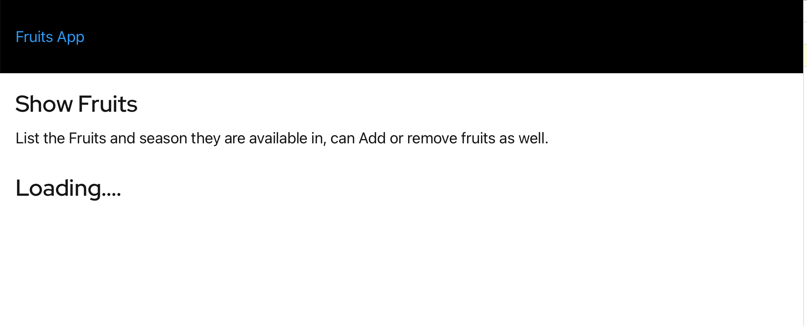

At the end of this chapter you would have known how to:

- [x] Configure CORS

Gloo Edge also supports configuring the CORS policies without the need to redeploy the backend API application. As part of this section we will extend our demo `Fruits API` with simple SPA.

## Build the UI Application

Since the SPA are accessed from browser we need to rebuild the UI with th `GLOO_PROXY_URL` that the application need to use,

```shell
docker build --build-arg="GLOO_PROXY_URL=$GLOO_PROXY_URL" \
  -t example/fruits-ui \
  -f $TUTORIAL_HOME/Dockerfile-UI $TUTORIAL_HOME
```

Once the contianer is built let us run it,

```shell
docker run --rm -p 8085:8080 example/fruits-ui
```

When you open the [localhost:8085](http://localhost:8085) in the browser you will see application page like



When you open the browser' developer tools console, you should notice the CORS errors like:


## Update Virtual Service

To fix this we need to update the Virutal Service with CORS options,

```yaml
apiVersion: gateway.solo.io/v1
kind: VirtualService
metadata:
  name: fruits-api
  namespace: gloo-system
spec:
  displayName: FruitsAPI
  virtualHost:
    options:
      # -------- CORS Config  -----------
      cors: # (1)
        allowOriginRegex:
          - '^http(s)?:\/\/localhost:[0-9]{4,5}$' # (2)
        allowHeaders: # (3)
          - origin
          - content-type
        allowMethods: # (4)
          - DELETE
        maxAge: 1d
      # -------- Web Application Firewall - Check User-Agent  -----------
      waf:
        customInterventionMessage: "Firefox not supported"
        ruleSets:
          - ruleStr: |
              SecRuleEngine On
              SecRule REQUEST_HEADERS:User-Agent ".*Firefox.*" "deny,status:403,id:107,phase:1,msg:'unsupported user agent'"
    domains:
      - "*"
    routes:
      # --------------------- Application Routes -----------------
      - matchers:
          - prefix: /api/
        routeAction:
          single:
            upstream:
              name: fruits-app-fruits-api-8080
              namespace: gloo-system
        options:
          prefixRewrite: /v1/api/
          # ---------------- Rate limit config ----------------------
          rateLimitConfigs:
            refs:
              - name: global-limit
                namespace: gloo-system

```

1. Enable CORS options
2. The Origin Regular Expression, this will allow all `localhost`
3. The CORS headers that are allowed
4. The methods that the orgins can excute

Now let us update the virtual service,

```shell
kubectl apply -n gloo-system -f $TUTORIAL_HOME/apps/microservice/fruits-api/gloo/virtual-service-cors.yaml
```

Now try refreshing the browser url [localhost:8085](http://localhost:8085) and you will see a list of fruits as shown without any CORS errors.


---8<--- "includes/abbrevations.md"
