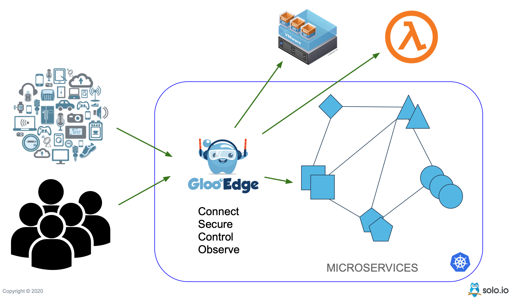

# Gloo Edge Security Tutorial

As part of this short tutorial we will explore few security concepts that are required with every microservice deployment and how  [Gloo Edge](https://www.solo.io/products/gloo-edge/) can help you to configure them easily and securely.

At the end of this short tutorial you would have learnt,

- [x] Setup minikube cluster
- [x] Deploy Gloo Edge Enterprise minikube cluster
- [x] Secure your Cloud Native Applications with Gloo Edge by,
      - Doing RateLimiting
      - Doing WAF
      - Doing CORS
      - Doing oAuth
      - Doing Traffic Encrypton

{align=center}

---8<--- "includes/abbrevations.md"
